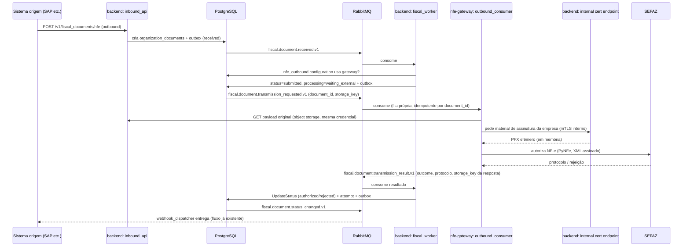
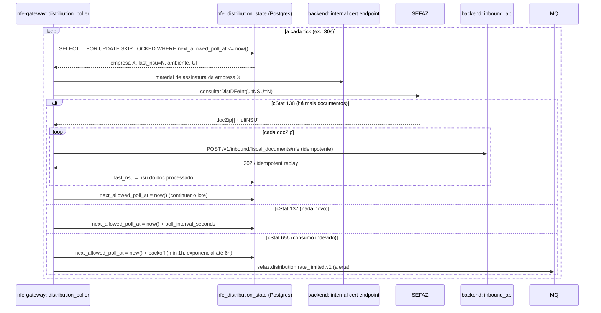

# NF-e Gateway (serviço de mensageria PyNFe)

## Motivação

O `backend` (Go) não fala o protocolo SOAP/XML assinado da SEFAZ nem tem uma lib madura para isso — por isso `internal/fiscal/provider.go` hoje só tem um `StubProvider`, e não existe nenhum consumidor da consulta de distribuição por NSU. O [PyNFe](https://github.com/TadaSoftware/PyNFe) resolve a parte SEFAZ (assinatura XML, comunicação com os webservices, distribuição por NSU), mas é Python — não faz sentido reescrever isso em Go nem embutir um interpretador Python dentro do `backend`.

Este documento desenha um **terceiro serviço, `nfe-gateway/`** (novo diretório na raiz, irmão de `backend/` e `frontend/`), responsável por tudo que precisa falar com a SEFAZ de fato. Ele não duplica o domínio fiscal — reaproveita `organization_documents`/`organization_nfe` e o pipeline de inbound já existentes (`06_fiscal_documents.md`, `07_inbound_api.md`, `21_fiscal_inbound_orchestrator.md`), entrando como mais um **provider assíncrono** conectado por mensageria.

## Fronteira de responsabilidade

| Preocupação | Dono | Por quê |
|---|---|---|
| Identidade, tenant, empresas, certificados (metadados), status do documento, matching/validação, webhooks | `backend` (Go) | já implementado, single-writer nas tabelas fiscais, guarda o state machine e o outbox transacional |
| Chave privada / material de assinatura (Key Vault ou local) | `backend` (Go) | único serviço com credencial do Key Vault; nunca duplicar essa credencial em outro processo |
| Construção/assinatura/transmissão do XML à SEFAZ, consulta de distribuição por NSU, cadência/backoff dessa consulta | `nfe-gateway` (Python/PyNFe) | é exatamente o que o PyNFe resolve; a lógica de rate limit da SEFAZ é interna a essa consulta e não deveria vazar para o Go |
| Payload bruto (XML/JSON de entrada e saída) | Object storage (compartilhado) | já é o padrão hoje — mensageria carrega IDs, não o XML inteiro (`08_messaging_and_workers.md`) |

Regra geral: **o `nfe-gateway` nunca escreve em `organization_documents`/`organization_nfe`/`organization_document_events` diretamente.** Para inbound ele entra pelo mesmo endpoint HTTP que qualquer sistema de origem usaria; para outbound ele só publica um evento de resultado e quem aplica a transição de status é o Go (mesmo state machine, mesmo outbox, zero duplicação de regra). Isso evita ter duas implementações do "o que acontece quando um documento é rejeitado" em duas linguagens.

## Pré-requisito: mensageria real entre processos

Hoje `internal/platform/broker.MemoryBroker` é só um pub/sub in-process (usado pelo `outbox_relay` para chamar o `webhook.Service` dentro do mesmo binário) — `BROKER_BACKEND=memory` é o default, e `RabbitMQURL`/o container `rabbitmq` do `docker-compose.yml` já existem mas não são usados por nenhum código Go ainda. Para o `nfe-gateway` existir como processo separado, isso precisa virar real:

- Novo `internal/platform/broker/rabbitmq.go` implementando `Publisher`/`Subscriber` com `amqp091-go`, exchange topic `fiscal.events` (durável), uma queue durável por consumidor ligada pela routing key (nome do evento), dead-letter exchange por queue reaproveitando o conceito de `dead_letter_events` já documentado.
- `outbox_relay` passa a publicar no RabbitMQ real quando `BROKER_BACKEND=rabbitmq` (troca de implementação, sem mudar a lógica de claim/outbox).
- Do lado Python, `aio-pika` consumindo a mesma exchange/routing keys, com dedupe via uma tabela `inbox_events` própria (mesmo padrão do `08_messaging_and_workers.md`, `unique(consumer_name, event_id)`), já que o at-least-once do RabbitMQ exige idempotência no consumidor de qualquer forma.

Sem isso o resto do desenho não tem como ser implementado — é o primeiro item da lista de próximos passos, mesmo sendo "só" infraestrutura.

## Fluxo outbound (emissão)



Pontos importantes:

- `Provider.Transmit` ganha uma segunda implementação, `MessagingProvider`, ao lado do `StubProvider` — ela só publica o evento e devolve `ProviderResult{Outcome: "submitted"}`. O state machine já tem `ProcessingWaiting`/`StatusSubmitted` prontos para isso (`internal/fiscal/status.go`) — não é preciso mudar schema nem o worker além de trocar o provider por empresa/ambiente (dev continua no `StubProvider`, produção usa `MessagingProvider`).
- O consumidor do resultado (`fiscal.document.transmission_result.v1`) é só mais um handler no mesmo `fiscal_worker` (ou um processo irmão pequeno) chamando `Service.UpdateStatus` — reaproveita `NextStatusesFromProvider`/`EventTypeForOutcome` de `internal/fiscal/status.go` byte a byte.
- `document_id` é a chave de correlação nos dois sentidos; como o consumo é at-least-once, o handler de resultado precisa ser idempotente — `UpdateStatus` já é (`where status = fromStatus`, conflito otimista vira no-op seguro numa reentrega).
- O XML de resposta da SEFAZ (autorização/protocolo) é gravado no object storage como um novo `payload_type = 'sefaz_response'` em `organization_document_payloads`, não trafega inteiro na fila.

## Fluxo inbound (distribuição por NSU)

Baseado no fluxo descrito na [wiki do PyNFe](https://github.com/TadaSoftware/PyNFe/wiki/Fluxo-da-Consulta-de-Distribuicao-por-NSU): a consulta devolve lotes de `docZip` (resumo/NFe completa/evento, compactado) mais `ultNSU`/`maxNSU`; `cStat 138` = ainda há mais para baixar (pode consultar de novo imediatamente), `cStat 137` = não há mais nada agora (esperar o próximo ciclo), qualquer rejeição por excesso de consumo deve ser tratada como circuit breaker, não como erro comum.



### Por que a distribuição não passa pelo `cmd/scheduler` do Go

A cadência e o backoff da consulta são estado interno da própria consulta (quantos documentos faltam, se a SEFAZ acabou de rejeitar por excesso). Fazer o Go decidir "quando" e mandar isso por fila só adicionaria uma volta sem necessidade — o Go não precisa saber que existe um NSU, só precisa receber os documentos resultantes pelo endpoint de inbound que já existe. `nfe-gateway` tem seu próprio loop (`distribution_poller`), independente do `cmd/scheduler` do backend.

### Concorrência e rate limit

O limite real da SEFAZ (confirmado via NT 2014.002 e reproduzido de forma consistente por vários fornecedores/ERPs que já bateram nele) — não é uma regra que escolhemos, é o que o próprio webservice de distribuição aplica:

- **20 consultas por hora** por CNPJ/certificado — teto rígido, inclusive durante uma rajada de `cStat 138` (ainda há lote) consultando em sequência. Ultrapassar devolve `656 — Consumo indevido — ultrapassou o limite de 20 consultas por hora`, e bloqueia o CNPJ pelo resto daquela janela (desbloqueio automático depois).
- **`cStat 137` (nada novo) também tem piso de 1h**: consultar de novo dentro da próxima hora depois de um 137 já é `656`, mesmo sem ter batido no teto de 20/h — são duas regras independentes, as duas com o mesmo piso de 1h.

Implementado em `nfe_gateway/distribution_state.py` (`CallWindow`/`record_call`/`decide_next_poll`, 14 testes):

- **Orçamento móvel de 1h**: cada linha de estado carrega `window_started_at`/`calls_in_window`; toda consulta real (sucesso ou erro) incrementa via `record_call`, que reinicia a janela sozinho quando ela expira. O código nunca usa o teto de 20 diretamente — `SAFE_CALLS_PER_WINDOW = 18` deixa margem de duas chamadas para variação de relógio/latência.
- **`cStat 138` respeita o orçamento, não só "consulta de novo na hora"**: enquanto `calls_in_window < 18`, a próxima consulta pode ser imediata (é o próprio protocolo quem sinaliza isso, não um timer fixo); ao atingir o teto seguro, espera até `window_started_at + 1h` mesmo com lote pendente — é exatamente o padrão que dispara `656` em quem não trata isso.
- **`cStat 137`**: `poll_interval_seconds` configurável por empresa, mas sempre com piso de `max(poll_interval_seconds, 3600)` — o valor configurado só pode alongar a espera, nunca encurtar abaixo do piso real da SEFAZ.
- **Circuit breaker em `cStat 656`**: backoff exponencial com piso de exatamente 1h (jitter só soma tempo, `1.0–1.15x` — a versão anterior usava `0.85–1.15x`, que podia resolver em ~51min e violar o próprio piso que estava tentando respeitar) e teto de 6h; a janela de chamadas é reiniciada zerada no horário do próximo poll permitido, já que a SEFAZ está tratando isso como violação da janela atual. Emite `sefaz.distribution.rate_limited.v1` (alerta, encaminhável a webhook interno) em vez de tentar de novo silenciosamente.
- **Erro transitório (timeout, 5xx, falha de rede)**: backoff próprio, bem mais curto (base 10s, teto 30min) e não mexe no orçamento de 1h — é uma falha nossa/de rede, não um consumo real do limite da SEFAZ.
- **Serialização por empresa + lease anti-double-claim**: o `SELECT ... FOR UPDATE SKIP LOCKED` é o claim e também garante que nunca há duas consultas simultâneas pro mesmo CNPJ. Como o `UPDATE` do claim libera o lock antes do poll terminar, a linha também é "arrendada" (`next_allowed_poll_at = now() + 5min`) no mesmo claim — sem isso, um poll lento (ou uma queda no meio da chamada à SEFAZ) deixava a linha reclamável de novo no próximo tick de 30s, arriscando uma segunda chamada real à SEFAZ enquanto a primeira ainda estava em voo.
- **Teto global**: um semáforo limita quantas consultas SEFAZ o `nfe-gateway` mantém em voo ao mesmo tempo (`DISTRIBUTION_MAX_CONCURRENT_SEFAZ_CALLS`), independente de quantas empresas estão "devidas" no mesmo instante.
- **Progresso só avança depois do ack do inbound**: `last_nsu` só é gravado depois que `POST /v1/inbound/fiscal_documents/nfe` responde com sucesso (ou replay idempotente). Se o processo cair no meio de um lote, ele retoma do NSU exato que faltou reprocessar — reprocessar um NSU já enviado é seguro porque o endpoint de inbound é idempotente.

## Modelo de dados novo

Uma tabela nova, no mesmo Postgres compartilhado (mesmo princípio de "banco compartilhado com isolamento por `organization_id`" do `01_system_architecture.md`), de propriedade do `nfe-gateway` — o Go não escreve nela, só o `backend` lê para expor num futuro painel de operação se necessário:

```sql
create table organization_company_nfe_distribution_state (
    id uuid primary key,
    organization_id uuid not null references organizations(id),
    organization_company_id uuid not null references organization_companies(id),
    last_nsu bigint not null default 0,
    max_nsu bigint not null default 0,
    poll_interval_seconds integer not null default 1200,
    status varchar(20) not null default 'active' check (status in ('active', 'paused', 'error')),
    consecutive_empty_polls integer not null default 0,
    consecutive_errors integer not null default 0,
    last_cstat text,
    last_message text,
    last_poll_at timestamptz,
    last_success_at timestamptz,
    next_allowed_poll_at timestamptz not null default now(),
    window_started_at timestamptz not null default now(), -- 008_nfe_distribution_rate_limit.sql
    calls_in_window integer not null default 0,            -- idem — orçamento móvel de 1h, ver "Concorrência e rate limit"
    created_at timestamptz not null default now(),
    updated_at timestamptz not null default now(),
    version bigint not null default 1,
    unique (organization_company_id) -- 012: um estado de distribuição por empresa; não duplica environment/uf abaixo
);
```

`uf`/`environment` **não** ficam nesta tabela — vêm de `organization_companies` via join (migration `011_organization_company_uf.sql`, que adicionou `organization_companies.uf`), a única fonte de verdade. A versão original desta tabela duplicava os dois, e nada escrevia neles depois da criação da linha — risco real de desatualizar se a UF/ambiente da empresa fosse corrigido depois; corrigido antes de qualquer dado real existir (só dado de teste, já removido). `nfe_gateway/db.py`'s `claim_due_companies` reflete isso: `join organization_companies oc on oc.id = st.organization_company_id ... and oc.uf is not null` — uma empresa sem UF cadastrada nunca é reclamada para polling, porque não haveria pra onde rotear a chamada SEFAZ.

create index idx_nfe_distribution_state_due
    on organization_company_nfe_distribution_state (next_allowed_poll_at)
    where status = 'active';
```

`poll_interval_seconds` por empresa (não global) porque cada CNPJ tem seu próprio limite perante a SEFAZ. A ativação/pausa de "distribuição automática" fica pendurada no serviço `nfe_inbound` já existente (`organization_company_services.configuration_json`, ex. `{"distribution": {"enabled": true}}`) em vez de virar um novo `service_id` no catálogo — reaproveita o gate que `fiscal.Service.Receive`/`HasCompanyService` já checam; o `nfe-gateway` só cria/ativa a linha em `organization_company_nfe_distribution_state` quando essa flag está ligada.

Uma segunda tabela, opcional mas recomendada para observabilidade/debug de rate limit (cada tentativa de consulta, não só o estado atual):

```sql
create table organization_company_nfe_distribution_polls (
    id uuid primary key,
    organization_company_id uuid not null references organization_companies(id),
    requested_nsu bigint not null,
    cstat text,
    documents_found integer not null default 0,
    outcome varchar(20) not null, -- 'has_more' | 'no_content' | 'rate_limited' | 'error'
    error_message text,
    started_at timestamptz not null,
    finished_at timestamptz not null,
    created_at timestamptz not null default now()
);
```

## Certificado digital: Key Vault ou local, mas sempre via Go

O `nfe-gateway` **nunca** tem credencial própria do Azure Key Vault. Isso mantém a superfície de acesso à chave privada de todas as empresas em um único lugar auditável (já é o caso hoje — `internal/certificate` é o único código que fala com o Vault).

- Novo endpoint interno `POST /internal/v1/companies/{company_id}/certificates/signing-material`, exposto só na rede interna (nunca no `inbound_api` público), autenticado por um segredo de serviço-a-serviço (ou mTLS) — nunca a conta de um usuário humano nem um `organization_api_client` de tenant.
- `keyvault.CertificateStore` ganha um método de exportação (`ExportCertificate(ctx, name) (pfx []byte, err)`) usando o client de Secrets do mesmo Vault — certificados importados como exportáveis no Key Vault têm um "segredo gêmeo" com o mesmo nome que devolve o PFX completo em base64, sem precisar guardar a senha original em lugar nenhum.
- Para dev/local sem Azure (`AZURE_KEY_VAULT_URL` vazio), um `LocalFileCertificateStore` implementa a mesma interface cifrando o PFX em disco com `SECRETS_ENCRYPTION_KEY` (o mesmo helper AES-256-GCM já usado para `client_secret` das integrações SAP) — o `nfe-gateway` não sabe nem precisa saber qual dos dois está por trás do endpoint. No import, ele reencoda o PFX **sem senha** (`software.sslmate.com/src/go-pkcs12`, encoder `Modern`, senha `""` — ainda cifrado, só sem senha, a mesma convenção do Key Vault) para o contrato de `ExportCertificate` ser idêntico nos dois backends: quem chama nunca precisa saber nem carregar a senha original de import.
- O `nfe-gateway` recebe o PFX **em memória**, grava num arquivo temporário só porque `pynfe.entidades.certificado.CertificadoA1` espera um path (não aceita bytes), e apaga esse arquivo (e zera o buffer) em `finally` imediatamente após a chamada SOAP — mesma disciplina do `defer zeroBytes(...)` que `internal/certificate/service.go` já aplica ao PFX recebido do upload. Ver a próxima seção para os detalhes exatos, confirmados lendo o código-fonte do PyNFe.
- Toda chamada a esse endpoint gera um evento de auditoria (`audit.Write`, ação `certificate.signing_material_accessed`) no Go, então fica visível quantas vezes e quando a chave privada de cada empresa foi usada.

## Como o PyNFe assina de fato (confirmado lendo o código-fonte)

Não é preciso fazer fork nem monkeypatch do PyNFe para o fluxo de assinatura com certificado do Key Vault funcionar. Confirmado lendo `pynfe/entidades/certificado.py`, `pynfe/processamento/assinatura.py` e `pynfe/processamento/comunicacao.py` (`TadaSoftware/PyNFe@main`):

- `CertificadoA1(caminho_arquivo)` sempre lê o PFX de um caminho no sistema de arquivos (`open(self.caminho_arquivo, "rb")`) — não existe construtor que aceite bytes. A biblioteca já foi escrita assumindo "qualquer certificado local, não importa de onde veio" (um smart card, um volume de segredos montado, etc.). O Key Vault é só mais uma origem — materializamos o PFX (já sem senha, ver acima) como um arquivo efêmero (`nfe-gateway/src/nfe_gateway/sefaz/client.py:ephemeral_pfx_path`) bem antes da chamada e apagamos logo depois. Não é um contorno imposto pela nossa arquitetura, é o uso normal da biblioteca.
- A partir desse único caminho, o PyNFe deriva a chave/certificado em dois lugares independentes por autorização, só um deles toca disco de novo:
  - **Assinatura XML** (`AssinaturaA1`) — `separar_arquivo(senha)` com `caminho=False` (default): devolve os bytes PEM direto em memória, assina via `signxml`. Nenhum arquivo temporário extra.
  - **Transporte SOAP/HTTPS** (`ComunicacaoSefaz._post`) — usa `caminho=True`, porque o parâmetro `cert=` do `requests` para mTLS exige paths de verdade, não bytes. Isso cria um **segundo** par de arquivos temporários (a chave privada em PEM, **sem** cifrar!) via `tempfile.NamedTemporaryFile(delete=False)` — mas o próprio PyNFe limpa isso sozinho num `try/finally: certificado_a1.excluir()` em volta de cada `_post`. Não é vazamento, só uma janela breve em disco durante cada chamada.
  - As duas janelas (a nossa e a do próprio PyNFe) ficam cobertas apontando `TMPDIR` para um tmpfs/ramdisk (ex. `/dev/shm`) no deploy — o módulo `tempfile` do Python já respeita `TMPDIR` sozinho, é configuração de processo, não código.
- **Lacuna real da biblioteca, não bloqueia funcionamento, vale endurecer depois**: todo `_post`/`_post_https` em `pynfe/processamento/comunicacao.py` chama `requests.post(..., verify=False, ...)` — o PyNFe nunca valida o certificado TLS do servidor da SEFAZ, em nenhuma UF. O corpo da NF-e é assinado separadamente e a SEFAZ valida essa assinatura por conta própria, então isso não é um buraco de integridade do payload, mas permite um atacante de rede interceptar/redirecionar a conexão sem ser detectado. Para corrigir sem fazer fork do pacote inteiro: subclassar `ComunicacaoSefaz` e sobrescrever `_post` (só usa `self.uf`/`self.certificado`/`self.certificado_senha`, todos atributos públicos do construtor — seguro de sobrescrever), copiando as ~20 linhas do `_post` original com `verify=True`. Vale também reportar upstream.

## Autenticação: dois mecanismos diferentes, de propósito

O `nfe-gateway` fala com dois endpoints do backend, e eles não usam o mesmo tipo de credencial — misturar os dois quebra silenciosamente (a primeira versão do scaffold cometia esse erro: mandava o token estático do `internal_api` também pro `inbound_api`, que exige um JWT assinado e teria rejeitado tudo).

- **`internal_api` (material de assinatura)**: token estático único (`NFE_GATEWAY_SERVICE_TOKEN`), comparado em tempo constante. Endpoint nunca exposto fora da rede interna — a simplicidade é proposital, ver "Certificado digital" acima.
- **`inbound_api` (`POST /v1/inbound/fiscal_documents/nfe`)**: é o endpoint público que qualquer ERP usaria, então o `nfe-gateway` se autentica exatamente como um `organization_api_client` normal (`07_inbound_api.md`) — OAuth2 client-credentials (`POST /v1/oauth/token`, no `control_plane_api`, **não** no `inbound_api` nem no `internal_api` — é uma terceira URL), JWT com `organization_id`/`source_system`/`scopes`, escopo `fiscal_documents:inbound:create` exigido pelo handler — mais estreito que o legado `fiscal_documents:create` (que também libera outbound): uma credencial do gateway vazada não consegue emitir documentos outbound, só alimentar o pipeline de inbound.

Como cada `organization_api_client` pertence a uma única organização (o modelo não tem credencial cross-tenant), o gateway precisa de um `client_id`/`client_secret` por organização. E como o backend só devolve o `client_secret` em texto puro **uma vez**, no momento da criação (`organization_api_client_credentials.client_secret_hash` é hash, igual senha — não recuperável depois), o provisionamento é um passo manual: criar o client via `POST /v1/organizations/{id}/api_clients` (`source_system=nfe_gateway_distribution`, escopo `fiscal_documents:inbound:create`) e entregar o segredo ao gateway uma vez via `python -m nfe_gateway.provision_credentials` (pede o segredo via `getpass`, nunca aceita por flag de linha de comando) — que grava cifrado (`cryptography.Fernet`, chave `NFE_GATEWAY_CREDENTIALS_KEY`) em `nfe_gateway_organization_credentials` (tabela do gateway, migration `009_nfe_gateway_org_credentials.sql`). `oauth.TokenCache` troca isso por um JWT de curta duração e cacheia em memória por organização, renovando 5 minutos antes de expirar.

Testado ao vivo ponta a ponta: client criado via `control_plane_api` real, credenciais provisionadas, token emitido e cacheado (segunda chamada não gera novo request HTTP), aceito pelo `inbound_api` real — a requisição passou de autenticação/escopo e chegou até a validação de negócio (rejeitada só por CNPJ de teste não cadastrado, como esperado). Também confirmado: a mesma credencial tentando postar um documento **outbound** é rejeitada com 403 antes de tocar em qualquer lógica de negócio.

## Segurança: revisão e correções (2026-08-16)

Passo de revisão manual pedido explicitamente (sem repo git local, `/security-review` não roda) cobrindo tudo construído para este serviço. Corrigido nesta rodada:

- **Rate limit/bloqueio em `POST /v1/oauth/token`**: `organization_api_client_auth_attempts` (migration `010_api_client_auth_lockout.sql`) — 10 tentativas falhas numa janela de 15min bloqueia o `client_id` (existente ou não, protege contra enumeração também) por 15min, `AuthenticateAPIClient` checa antes de qualquer coisa. Defesa em profundidade, não a proteção primária — `client_secret` já tem 256 bits de entropia (`crypto.RandomToken(32)`), força bruta online não é viável de qualquer forma. Testado ao vivo: 10 tentativas erradas → a 11ª, mesmo com a senha certa, volta `429`.
- **Emissão de token auditada**: `AuthenticateAPIClient` grava `audit.Write` (ação `api_client.token_issued`) a cada autenticação bem-sucedida, best-effort (uma falha de auditoria não pode derrubar a emissão de token pra todo mundo). Testado ao vivo, evento confirmado em `audit_events`.
- **Escopo granular inbound/outbound**: `fiscal_documents:inbound:create`/`fiscal_documents:outbound:create` (novos, em `allowedAPIClientScopes`) ao lado do `fiscal_documents:create` legado (mantido por compatibilidade — clientes já provisionados continuam funcionando). `receiveInboundDocument`/`receiveDocument` aceitam o escopo específico OU o legado (`auth.HasAnyScope`). Testado ao vivo com uma credencial só-inbound: outbound rejeitado com 403, inbound passa.
- **Object storage local cifrado em repouso**: `storage.LocalStore` agora exige uma chave de 32 bytes (`SECRETS_ENCRYPTION_KEY`, mesmo helper AES-256-GCM de sempre) e falha ao iniciar sem ela — os 4 processos que persistem documento fiscal (`control_plane_api`, `inbound_api`, `fiscal_worker`, `inbound_orchestrator_worker`) exigem a chave agora. Torna real o princípio já documentado em `01_system_architecture.md` ("payload bruto armazenado em object storage criptografado"), que antes só valia pra um backend de nuvem hipotético, não pro backend local de fato usado hoje. Testado ao vivo: payload postado com um marcador único, arquivo em disco não contém o marcador; uma segunda instância com chave diferente não consegue decifrar.
- **`internal_api` com allowlist de IP em código**: `httpx.IPAllowlist` (`INTERNAL_API_ALLOWED_CIDRS`, default loopback + faixas RFC1918 — cobre Docker/K8s típico) — backstop de código pra um firewall/rede mal configurado não expor o endpoint por acidente. Não substitui isolamento de rede real nem TLS (ver nota no `InternalAPI`). Testado: `/health` continua acessível de `localhost`.
- **Segredo de provisionamento fora do argv**: `provision_credentials.py` não aceita mais `--client-secret` como flag (ficava visível em `ps`/histórico do shell) — pede via `getpass` ou lê de stdin (`--stdin`, para automação).
- **Aviso de TLS explícito**: doc comment do `InternalAPI` deixa claro que nada no `net/http` força TLS, e a resposta desse endpoint é material de chave privada — em qualquer deploy além de localhost isso precisa rodar atrás de TLS/mTLS.

Sinalizado e decidido em conjunto, não corrigido nesta rodada (fora do escopo do `nfe-gateway` propriamente): rotação de `SECRETS_ENCRYPTION_KEY`/`NFE_GATEWAY_CREDENTIALS_KEY`, e criptografia do object storage de produção real (depende de qual backend de nuvem for escolhido — a maioria já criptografa em repouso nativamente).

## Ambiente de homologação (QA)

Preparação de configuração pedida explicitamente antes de plugar um certificado real — nada aqui depende do certificado, é o que garante que, quando ele chegar, tudo por padrão aponta pra homologação, nunca produção.

- **UF da empresa — campo que não existia**: nada no schema capturava a UF de registro da empresa, e SEFAZ seleciona o webservice por UF (não só por ambiente). Adicionado `organization_companies.uf` (`char(2)`, migration `011_organization_company_uf.sql`), validado contra as 27 UFs reais (`internal/organization/cnpj.go`), aceito em `POST /v1/organizations/{id}/companies` (`uf` no body). Nullable de propósito — empresas sem UF continuam existindo, só não são elegíveis pra distribuição/emissão real: `nfe_gateway/db.py`'s `claim_due_companies` agora faz `join organization_companies ... and oc.uf is not null`, então uma empresa sem UF nunca é reclamada pro polling. Testado ao vivo: criação com UF válida normaliza pra maiúscula e persiste; UF inválida rejeitada com `422 invalid_uf`; join exclui corretamente uma empresa sem UF.
- **`organization_company_services` já tinha `environment` (`production`/`homologation`) por empresa** — `ValidateCompanyInput` já defaultava pra `homologation` quando não informado, então uma empresa nova já nasce em homologação a menos que alguém explicitamente peça produção. Nada mudou aqui, só confirmado — é o comportamento certo.
- **Trava de segurança no `nfe-gateway`, independente da empresa**: `SEFAZ_FORCE_HOMOLOGACAO` (default `true`) — `sefaz/environment.py`'s `resolve_homologacao(company_environment, force_homologacao)` só usa o `environment` da empresa quando o override está desligado. Enquanto estiver ligado (default), **nenhuma** chamada real vai pra SEFAZ produção, mesmo que uma empresa esteja (corretamente ou por engano) marcada como `production`. `PyNfeSefazClient` já recebe e aplica isso — só falta a implementação real dos dois métodos (mesmo bloqueio de sempre: certificado de homologação real pra validar a chamada exata).
- **Disclaimer obrigatório de homologação**: `sefaz/environment.py.HOMOLOGACAO_DISCLAIMER` = `"NOTA FISCAL EMITIDA EM AMBIENTE DE HOMOLOGACAO - SEM VALOR FISCAL"` — exigência do manual técnico da NF-e, não estilo: SEFAZ rejeita a nota em homologação se o `infCpl` não tiver esse texto. Documentado e com a constante pronta desde já, pra quem implementar `transmit_nfe` não esquecer.
- **Correção de schema encontrada nesse processo**: `organization_company_nfe_distribution_state` duplicava `uf`/`environment` (agora removidos, migration `011`) — e remover a coluna `environment` derrubou silenciosamente a constraint `unique(organization_company_id, environment)` que dependia dela (comportamento padrão do Postgres em `DROP COLUMN`), deixando a tabela sem nenhuma garantia de unicidade por empresa. Corrigido na sequência (migration `012`, `unique(organization_company_id)` sozinho — o substituto correto agora que `environment` não vive mais aqui).

Ainda pendente, não é config: `uf`/CNPJ reais da empresa semeada (`cmd/seed`) — `SEED_TENANT_UF` existe mas fica vazio até alguém informar o valor certo; nunca é seguro adivinhar a UF de registro real de uma empresa.

## Estrutura do novo serviço

```
nfe-gateway/
  pyproject.toml
  README.md
  .env.example
  src/nfe_gateway/
    config.py              # env vars (mesmos nomes/convenção do backend onde fizer sentido)
    db.py                  # pool asyncpg, claim helpers
    broker.py              # aio-pika: publish/consume, inbox_events dedupe
    backend_client.py      # HTTP: inbound ingest + internal cert endpoint
    storage.py             # leitura/escrita direta no object storage (mesmo bucket/prefixo do Go)
    sefaz/
      client.py            # wrapper fino sobre PyNFe (ComunicacaoSefaz)
      distribution.py      # parsing docZip, cStat, ultNSU/maxNSU
    distribution_state.py  # regras puras de próximo poll/backoff (testável sem SEFAZ)
    workers/
      distribution_poller.py
      outbound_consumer.py
  tests/
```

## O que fica de fora nesta rodada

- NFS-e (municipal, sem padrão único nacional) — o PyNFe tem suporte parcial via extra `nfse`, mas fica fora do escopo inicial; o serviço nasce só para NF-e.
- Emissão em contingência (offline) e eventos (carta de correção, cancelamento) — o desenho de mensageria comporta (mesmo padrão de comando/resultado), mas a primeira versão cobre autorização normal + distribuição.
- Painel de operação para visualizar `organization_company_nfe_distribution_state`/pausar manualmente — hoje seria só consulta direta no banco.
- Multi-região/HA do `nfe-gateway` além de "várias réplicas do poller com `SKIP LOCKED`" — suficiente para o volume atual, sem necessidade de líder eleito.

## Próximos passos (ordem sugerida)

1. ~~`internal/platform/broker/rabbitmq.go` (Publisher/Subscriber reais) + trocar `outbox_relay` para usá-lo quando `BROKER_BACKEND=rabbitmq`.~~ **Feito** — `internal/platform/broker/rabbitmq.go` + `factory.go` (`broker.Resolve`), `outbox_relay` publicando de verdade (testado contra o RabbitMQ local: 16 eventos publicados na primeira execução).
2. ~~Migration da tabela `organization_company_nfe_distribution_state` (+ tabela de log de polls).~~ **Feito** — `migrations/007_nfe_gateway_distribution.sql`, aplicada localmente (inclui `nfe_gateway_inbox_events` para a dedupe do lado Python).
3. ~~Endpoint interno de material de assinatura (`keyvault.ExportCertificate` + `LocalFileCertificateStore` + rota + auditoria).~~ **Feito** — `keyvault.ExportCertificate` (Azure via secret gêmeo do certificado) + `LocalFileCertificateStore` (PFX cifrado em disco com `SECRETS_ENCRYPTION_KEY`, mesmo helper AES-256-GCM das integrações SAP) + `keyvault.Resolve` (Azure > local > unconfigured) + `certificate.Service.ExportSigningMaterial` (audita `certificate.signing_material_accessed`) + `cmd/internal_api`/`InternalAPI` (`POST /internal/v1/companies/{id}/certificates/signing-material`, bearer token `NFE_GATEWAY_SERVICE_TOKEN`, porta própria `INTERNAL_HTTP_ADDR`). Testado local: boot limpo, fallback para o store local confirmado, round-trip de import/export coberto por teste automatizado com um certificado de teste real (`test/testdata/certificate/test_a1.pfx`).
4. ~~`MessagingProvider` em `internal/fiscal` + consumidor do evento de resultado (reaproveitando `status.go`).~~ **Feito** — `fiscal.MessagingProvider` (publica `fiscal.document.transmission_requested.v1`, devolve `submitted` na hora — `Worker.processOne` já sabia lidar com esse outcome, zero mudança lá) + `Worker.HandleTransmissionResult` (consome `fiscal.document.transmission_result.v1`, reaproveita `NextStatusesFromProvider`/`EventTypeForOutcome` byte a byte, idempotente via `IsStaleStatusConflict`). Seleção via `FISCAL_PROVIDER=stub|messaging` (default `stub` — só muda de verdade com opt-in explícito, já que sem o `nfe-gateway` rodando um documento ficaria preso em `submitted/waiting_external` para sempre). Testado ao vivo fim-a-fim: documento inserido → `ProcessBatch` → `submitted/waiting_external` → evento de resultado simulado publicado no RabbitMQ real → `authorized/completed` com 2 tentativas registradas.
5. Scaffold do `nfe-gateway`: config/db/broker/backend_client primeiro (sem SEFAZ real), testável fim-a-fim com um `StubSefazClient` local — só depois plugar o PyNFe de verdade contra homologação com um certificado de teste. **Feito, exceto o PyNFe em si**:
   - Rate limit da distribuição por NSU: **feito e testado** — `distribution_state.py` implementa o limite real da SEFAZ (20/h, piso de 1h após 137, ver "Concorrência e rate limit" acima), 19 testes, mais um bug real de tipo ambíguo em `record_poll_result` (asyncpg `AmbiguousParameterError`) e uma lacuna de double-claim (`claim_due_companies` sem lease) só encontrados testando ao vivo contra o Postgres — os dois corrigidos.
   - Autenticação do inbound: **feito e testado** — ver "Autenticação: dois mecanismos diferentes" acima. `oauth.py`/`credentials.py`/`provision_credentials.py`, migration `009_nfe_gateway_org_credentials.sql`.
   - **Único item que resta**: `sefaz/client.py` (`consult_distribution`/`transmit_nfe`) — os métodos reais do PyNFe já foram identificados (`ComunicacaoSefaz.consulta_distribuicao`/`autorizacao`, docstring do arquivo tem os detalhes), só falta um certificado de homologação real pra validar a chamada exata.
