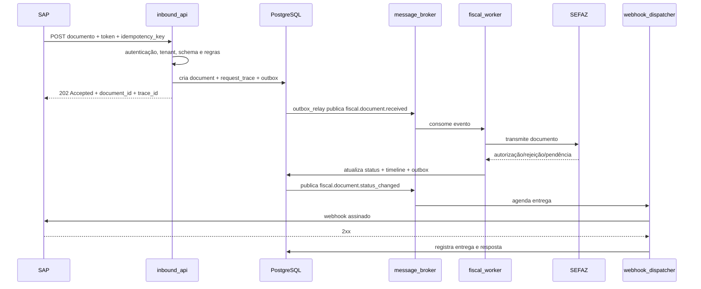

# Arquitetura do SaaS de Mensageria Fiscal

## Objetivo

Plataforma SaaS multi-tenant para receber documentos fiscais de sistemas como SAP, processá-los de forma assíncrona, encaminhá-los aos provedores fiscais/SEFAZ, armazenar o histórico completo e notificar sistemas externos por webhook.

## Princípios

- Banco compartilhado com isolamento lógico obrigatório por `organization_id`.
- Usuário global em `users`; permissões de negócio sempre derivadas do vínculo em `organization_members`.
- Administração da plataforma separada da administração do tenant.
- Nenhum segredo de integração armazenado em texto puro.
- Operações fiscais assíncronas, idempotentes e rastreáveis.
- Payload bruto armazenado em object storage criptografado; banco mantém metadados, hashes e referências.
- Eventos de domínio usando envelope compatível com CloudEvents.
- Outbox transacional para publicação de eventos.
- Inbox/idempotency para consumo de eventos e requisições.
- Webhooks assinados, com tentativas, backoff e dead-letter.
- Logs técnicos não substituem auditoria de negócio.
- Todo nome de schema, tabela, coluna, evento e arquivo segue `snake_case`.

## Contextos principais

1. Identity and Access Management
2. Organizations and Companies
3. Authentication Policies and SSO
4. Fiscal Documents
5. Inbound API
6. Messaging and Workers
7. Fiscal Provider/SEFAZ Integration
8. SAP/CPI Integration
9. Webhooks
10. Audit, Tracking and Observability
11. Platform Administration
12. Security and Compliance

## Fluxo resumido

## Arquivos

- `01_system_architecture.md`
- `02_multi_tenancy.md`
- `03_identity_and_access.md`
- `04_authentication_and_mfa.md`
- `05_organizations_and_companies.md`
- `06_fiscal_documents.md`
- `07_inbound_api.md`
- `08_messaging_and_workers.md`
- `09_sap_integrations.md`
- `10_webhooks.md`
- `11_tracking_and_audit.md`
- `12_security.md`
- `13_observability.md`
- `14_deployment_and_ha.md`
- `15_database_conventions.md`
- `16_entity_catalog.md`
- `17_status_and_event_catalog.md`
- `18_api_conventions.md`
- `19_retention_and_lgpd.md`
- `20_implementation_roadmap.md`
- `21_fiscal_inbound_orchestrator.md`
- `22_nfe_gateway_service.md`
- `23_billing_and_messaging.md`
